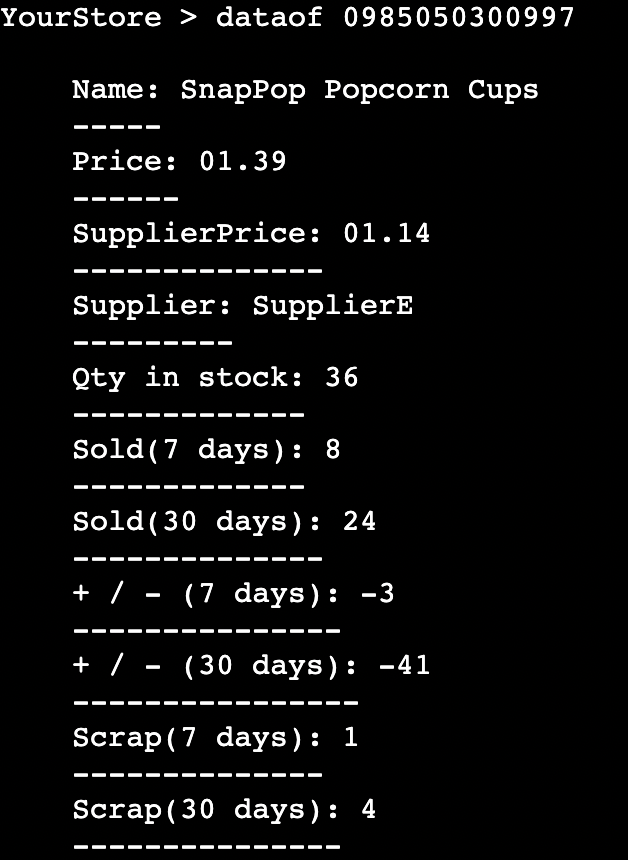
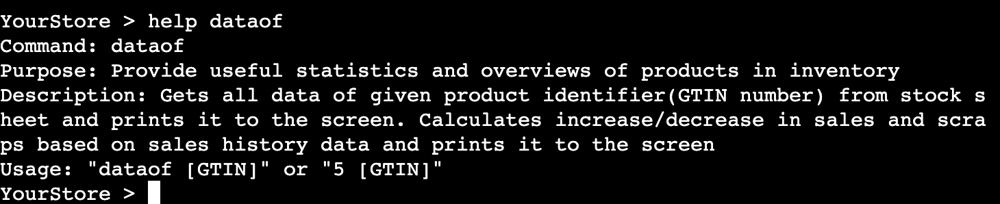

# Inventory Management System

Inventory Management System(IMS) is a terminal based inventory management system written using only python.

This app aims to provide a lightweight solution to inventory management for small business owners.

[Link to this project can be found here](https://inventorymanagementsystem-86826be60536.herokuapp.com/)


## How to use

- Type in commands via terminal either using the command names or their numeric indexes followed by a (fictional) Global trade item number(GTIN) if necessary

- Data can also be accessed and edited via the google sheets link

## Features / Commands

#### Existing features
- update
    - Provides the user a way of updating and storing their inventory data.
    - Reads the sales and scraps sheets, updates the stock sheet accordingly and stores the data in history.
- updateinv
    - Provides the user a way to update their inventory data, useful for e.g stocktaking.
    - Reads the inventory sheet and updates the stock sheet accordingly.
- priceof
    - Provides the user a way to search the price of a product in stock, useful for customer questions.
    - Searches the stock sheet for price info of given product id number(GTIN).
    
- instock
    - Provides the user a way to search the quantity of a product in stock, useful for customer questions.
    - Searches the stock sheet for quantity info of given product id number(GTIN).
    
- dataof
    - Provides the user a way to get an overview of a products data aswell as insightful statistics.
    - Searches the stock sheet for data of a given product id number(GTIN), compares data in the history and provides statistics such as increase / decrease in sales.
    
- scrap
    - Provides the user a way to add products to the scrap sheet, useful for e.g storeowners keeping track of stolen/broken items.
    - Initiates a loop where user can enter product id number(GTIN) and quantity, then adds it to the scrap sheet.
- help
    - Provides the user a way to get instructions on how to use the different features.
    - Prints info on how to use given command.
    
- exit
    - Provides the user a way to exit the program.
    - Terminates the script.

#### Future features

- Search product info by name
    - Provides a way to find information about a product by searching the product name
    - Useful if the GTIN is unknown
- Use databases instead of sheets and local files
    - Provides a more secure way to store data
    - Useful for keeping information private and secure


## Data model

I decided to use a Product class as my model. When a product id number(GTIN) is searched, the script creates a new instance of the Product class to hold the products information.

The Product class stores the products selling price, buying price, supplier name, quantity and gtin number.

The class also has methods to help other features, such as a get method which returns the wanted data in a nicer format for the user. A sold_scrap_items method which returns the total sales/scraps of a given time period from the history data, aswell as a compare_sales method which compares the sales of a given time period to the same time period the previous year.

## Testing

- Given invalid inputs:
    1. (Resolved)update
        - Input: 'update test'
        - Expected output: 'Invalid usage of (update): update takes no parameters'
        - Actual output: 'Invalid usage of update: update takes only 1 parameter'

        - Input: 'update 12345'
        - Expected output: 'Invalid usage of (update): update takes no parameters'
        - Actual output: 'Invalid usage of update: update takes only 1 parameter'

        - Input: '1 test'
        - Expected output: 'Invalid usage of (1): 1 takes no parameters'
        - Actual output: 'Invalid usage of 1: 1 takes only 1 parameter'
    2. (Resolved)updateinv
        - Input: 'updateinv test'
        - Expected output: 'Invalid usage of (updateinv): updateinv takes no parameters'
        - Actual output: 'Invalid usage of updateinv: updateinv takes only 1 parameter'

        - Input: '2 test'
        - Expected output: 'Invalid usage of (2): 2 takes no parameters'
        - Actual output: 'Invalid usage of 2: 2 takes only 1 parameter'
    3. priceof
        - Input: 'priceof 123'
        - Expected output: 'ERROR: no match for provided GTIN'
        - Actual output: 'ERROR: no match for provided GTIN'

        - Input: 'priceof 123 abc'
        - Expected output: 'Invalid usage of (priceof): priceof takes only 1 parameter'
        - Actual output: 'Invalid usage of (priceof): priceof takes only 1 parameter'

        - Input: '3'
        - Expected output: 'Invalid usage of (3): 3 requires additional parameter'
        - Actual output 'Invalid usage of (3): 3 requires additional parameter'

        - Input: 'priceof test'
        - Expected output: 'Invalid usage of (priceof): GTIN must be numeric'
        - Actual output: 'Invalid usage of (priceof): GTIN must be numeric'
    4. instock
        - Input: 'instock 123'
        - Expected output: 'ERROR: no match for provided GTIN'
        - Actual output: 'ERROR: no match for provided GTIN'

        - Input: '4'
        - Expected output: 'Invalid usage of (4): 4 requires additional parameter'
        - Actual output: 'Invalid usage of (4): 4 requires additional parameter'

        - Input: 'instock test'
        - Expected output: 'Invalid usage of (instock): GTIN must be numeric'
        - Actual output: 'Invalid usage of (instock): GTIN must be numeric'
    5. dataof
        - Input: 'dataof 123'
        - Expected output: 'ERROR: no match for provided GTIN'
        - Actual output: 'ERROR: no match for provided GTIN'

        - Input: '5'
        - Expected output: 'Invalid usage of (5): 5 requires additional parameter'
        - Actual output: 'Invalid usage of (5): 5 requires additional parameter'

        - Input: 'dataof test'
        - Expected output: 'Invalid usage of (dataof): GTIN must be numeric'
        - Actual output: 'Invalid usage of (dataof): GTIN must be numeric'
    6. scrap
        - Input: 'scrap test'
        - Expected output: 'Invalid usage of (scrap): scrap takes only 1 parameter'
        - Actual output: 'Invalid usage of scrap: scrap takes only 1 parameter'

        - Input: '6 123'
        - Expected output: 'Invalid usage of (6): 6 takes only 1 parameter'
        - Actual output: 'Invalid usage of 6: 6 takes only 1 parameter'
    7. (Resolved)help
        - Input: '7'
        - Expected output: 'Invalid usage of (7): 7 takes only 1 parameter'
        - Actual output: 'No such command: "7"'

        - Input: 'help test'
        - Expected output: 'Invalid usage of (help): No such command: test'
        - Actual output: 'Invalid usage of (help): No such command: test'

        - Input: 'help 1'
        - Expected output: 'Invalid usage of (help): No such command: 1'
        - Actual output: 'Invalid usage of (help): No such command: 1'
    8. exit
        - Input: 'exit test'
        - Expected output: 'Invalid usage of exit: exit takes only 1 parameter'
        - Actual output: 'Invalid usage of exit: exit takes only 1 parameter'
    
    - Input: 'test'
    - Expected output: 'No such command: "test"'
    - Actual output: 'No such command: "test"'

- Passed the code through a PEP8 linter and confirmed there are no important problems.
- Tested in my local terminal and the Code Institute Heroku terminal.

## Bugs

- Solved bugs:
    1. Shortcuts for commands not working
        - Resolved by adding the numeric options to execute_cmd()
    2. Crash when some types of invalid data is inputted
        - Resolved by adding error handling for all possible inputs
    3. Error when no data inputted on home screen
        - Resolved by verifying len() of inputted data > 0

Unsolved deprecation warning from gspread:

```UserWarning: [Deprecated][in version 6.0.0]: method signature will change to: 'Worksheet.update(value = [[]], range_name=)' arguments 'range_name' and 'values' will swap, values will be mandatory of type: 'list(list(...))'```

Tried updating gspread to latest version and using the correct syntax. Warning still shows. Positional keywords unexpected.
Bug in gspread lib?
## Validators

- PEP8
    - run.py
        - All clear, no errors found
    
    - functions.py
        1. 107: E501 line too long (99 > 79 characters)
        2. 360: E501 line too long (91 > 79 characters)
        3. 365: E501 line too long (105 > 79 characters)
        4. 369: E501 line too long (88 > 79 characters)
        5. 370: E501 line too long (81 > 79 characters)
        6. 373: E501 line too long (85 > 79 characters)
        7. 387: E501 line too long (84 > 79 characters)
    
    - product_model.py
        1. 30: E501 line too long (99 > 79 characters)
        2. 33: E501 line too long (86 > 79 characters)
        3. 56: E501 line too long (87 > 79 characters)
        4. 59: E501 line too long (93 > 79 characters)
        5. 78: E501 line too long (95 > 79 characters)
        6. 81: E501 line too long (178 > 79 characters)
        7. 85: E501 line too long (97 > 79 characters)
        8. 86: E501 line too long (102 > 79 characters)
        9. 91: E501 line too long (86 > 79 characters)
        10. 97: E501 line too long (117 > 79 characters)
        11. 127: E501 line too long (89 > 79 characters)
        12. 133: E501 line too long (100 > 79 characters)
        13. 137: E501 line too long (93 > 79 characters)
        14. 142: E501 line too long (87 > 79 characters)

    - print_output.py
        1. 1: E501 line too long (115 > 79 characters)
        2. 116: E501 line too long (151 > 79 characters)
        3. 120: E501 line too long (124 > 79 characters)
        4. 124: E501 line too long (128 > 79 characters)
        5. 128: E501 line too long (131 > 79 characters)
        6. 131: E501 line too long (88 > 79 characters)
        7. 132: E501 line too long (233 > 79 characters)
        8. 135: E501 line too long (80 > 79 characters)
        9. 136: E501 line too long (165 > 79 characters)
        10. 139: E501 line too long (83 > 79 characters)
        11. 140: E501 line too long (131 > 79 characters)
    
    - setup.py
        - All clear, no errors found


## Deployment

This project was deployed using Code Institute's mock terminal for Heroku.

- Steps for deployment:
    - Fork or clone this repository
    - Create a new Heroku app
    - Set the buildpacks to Python and NodeJS in that order
    - Link the Heroku app to the repository
    - Click on Deploy

## Credits

- Code Institute for the deployment terminal
- ChatGPT for generation of example product names and prices
- Google for API's and third-party spreadsheet software