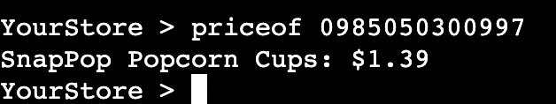

# Inventory Management System

Inventory Management System(IMS) is a terminal based inventory management system written using only python.

This app aims to provide a lightweight solution to inventory management for small business owners.

[Link to this project can be found here](https://inventorymanagementsystem-86826be60536.herokuapp.com/)

## How to use

- Type in commands via terminal either using the command names or their numeric indexes followed by a product id number(GTIN) if necessary

- Data can also be accessed and edited via the google sheets link

## Features / Commands

- update
    - Provides the user a way of updating and storing their inventory data.
    - Reads the sales and scraps sheets, updates the stock sheet accordingly and stores the data in history.
- updateinv
    - Provides the user a way to update their inventory data, useful for e.g stocktaking.
    - Reads the inventory sheet and updates the stock sheet accordingly.
- priceof
    - Provides the user a way to search the price of a product in stock, useful for customer questions.
    - Searches the stock sheet for price info of given product id number(GTIN).
    
- instock
    - Provides the user a way to search the quantity of a product in stock, useful for customer questions.
    - Searches the stock sheet for quantity info of given product id number(GTIN).
    
- dataof
    - Provides the user a way to get an overview of a products data aswell as insightful statistics.
    - Searches the stock sheet for data of a given product id number(GTIN), compares data in the history and provides statistics such as increase / decrease in sales.
    
- scrap
    - Provides the user a way to add products to the scrap sheet, useful for e.g storeowners keeping track of stolen/broken items.
    - Initiates a loop where user can enter product id number(GTIN) and quantity, then adds it to the scrap sheet.
- help
    - Provides the user a way to get instructions on how to use the different features.
    - Prints info on how to use given command.
    
- exit
    - Provides the user a way to exit the program.
    - Terminates the script.

## Data model

I decided to use a Product class as my model. When a product id number(GTIN) is searched, the script creates a new instance of the Product class to hold the products information.

The Product class stores the products selling price, buying price, supplier name, quantity and gtin number.

The class also has methods to help other features, such as a get method which returns the wanted data in a nicer format for the user. A sold_scrap_items method which returns the total sales/scraps of a given time period from the history data, aswell as a compare_sales method which compares the sales of a given time period to the same time period the previous year.

## Testing

- Given invalid inputs such as strings where numbers are expected and out of bound inputs.
- Tested in my local terminal and the Code Institute Heroku terminal.

## Bugs

## Validators

## Deployment

This project was deployed using Code Institute's mock terminal for Heroku.

- Steps for deployment:
    - Fork or clone this repository
    - Create a new Heroku app
    - Set the buildpacks to Python and NodeJS in that order
    - Link the Heroku app to the repository
    - Click on Deploy

## Credits

- Code Institute for the deployment terminal
- ChatGPT for generation of example product names and prices
- Google for API's and third-party spreadsheet software